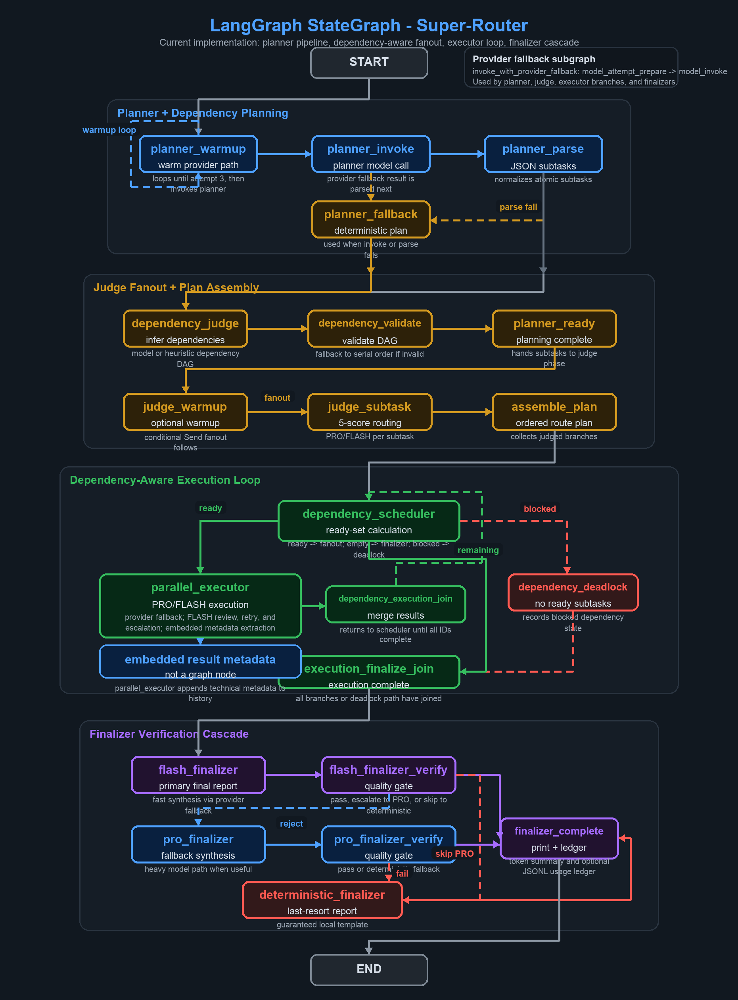

# Super Router

Super Router is a LangGraph-based task router that decomposes a user request,
judges each subtask, and executes ready subtasks across PRO and FLASH model
roles. It is built for workloads where some branches need stronger reasoning
while others are simple reporting, formatting, or low-risk IO.

The current implementation supports planner and dependency fallback paths,
dependency-aware executor fanout, provider fallback lists, FLASH retry and
FLASH-to-PRO escalation, embedded technical metadata extraction, LangSmith
tracing, and token usage accounting.

## Workflow



## What It Does

- Compacts long task text into deterministic context manifests before planning,
  judging, executing, metadata extraction, and finalization.
- Plans atomic subtasks with stable IDs and optional `depends_on` edges.
- Verifies and corrects the dependency DAG before execution.
- Scores each subtask on reasoning depth, code-change scope, ambiguity, risk,
  and IO heaviness.
- Routes subtasks to `PRO` or `FLASH` using model scores plus deterministic
  risk, summary, and confidence guards.
- Schedules only dependency-ready subtasks, fans them out with LangGraph
  `Send(...)`, joins completed waves, and repeats until the DAG is complete.
- Executes model calls through Codex CLI, Gemini CLI, Claude Code CLI, or
  Ollama, selected by model name.
- Retries FLASH on transient infrastructure failures and escalates to PRO on
  quality or capability failures.
- Extracts compact "technical gold" metadata from successful executor outputs
  inside each executor branch.
- Produces the final report through a FLASH finalizer, then a PRO finalizer,
  then a deterministic fallback report if model finalization fails.
- Tracks provider token usage per run, prints an aggregate summary, and can
  persist append-only JSONL records.

## Repository Layout

```text
.
|-- README.md
|-- SKILL.md
|-- super-router.png
|-- references/
|-- scripts/
|   |-- render_super_router_diagram.py
|   `-- router.py
|-- templates/
`-- tests/
    |-- __init__.py
    `-- test_router.py
```

| Path | Purpose |
| --- | --- |
| `SKILL.md` | Hermes skill metadata and agent-facing usage contract. |
| `scripts/router.py` | Main LangGraph router, provider dispatch, fallback logic, telemetry, token accounting, and CLI. |
| `scripts/render_super_router_diagram.py` | Deterministic diagram renderer; verifies the diagram node set against `build_router_graph()`. |
| `super-router.png` | Current architecture diagram used by this README. |
| `tests/test_router.py` | Offline regression tests using `unittest` and mocks. |
| `references/` | Supplemental operational notes. |
| `templates/` | Shell helper templates. |

## Requirements

- Python 3.10+.
- `langgraph` for the runtime graph.
- `langsmith` only when optional telemetry is enabled.
- `Pillow` only when regenerating `super-router.png`.
- At least one usable model provider:
  - Codex CLI for `codex/...`, bare `gpt-*`, bare `chatgpt-*`, or bare
    `o` plus digit model names.
  - Gemini CLI for `google-gemini-cli/...`, `gemini-*`, `auto`, `pro`,
    `flash`, or `flash-lite`.
  - Claude Code CLI for `claude/...` or bare `claude-*` model names.
  - Ollama for all other names, or explicit `ollama/...`.

Install the required runtime dependency:

```bash
pip install langgraph
```

Optional dependencies:

```bash
pip install langsmith
pip install pillow
```

## Installation

### As a Hermes Skill

If you use Hermes, install or point Hermes at this skill directory, then place
router configuration in `~/.hermes/.env`. Hermes loads that file and injects the
variables into child `terminal()` processes.

Typical skill-source install:

```bash
hermes skills tap add https://github.com/fanyadan/super-router
hermes skills install super-router
```

After installation, trigger it with phrasing such as `use super-router` or
`走 super-router`.

### Standalone

Run from this repository after installing `langgraph`:

```bash
python scripts/router.py "Inspect router state flow and summarize"
```

For Ollama-backed models, start Ollama and pull the models you intend to use:

```bash
ollama serve
ollama pull <model-name>
```

## Quick Start

Run a task:

```bash
python scripts/router.py "Analyze a multi-step task and prepare an action summary"
```

Stream node-level LangGraph progress:

```bash
python scripts/router.py --stream "Analyze a complex task, identify required actions, and draft a final note"
```

Pass the task through the environment:

```bash
ROUTER_TASK="Update a module, add tests, and refresh documentation" \
python scripts/router.py
```

Run tests:

```bash
python -m unittest tests/test_router.py
```

## Current Architecture

The main graph is built by `build_router_graph()` in `scripts/router.py`.

```text
START
  -> planner_warmup
       loops until 3 attempts, or is skipped with ROUTER_SKIP_WARMUP
  -> planner_invoke
  -> planner_parse
       parse failure -> planner_fallback
  -> dependency_judge
  -> dependency_validate
       invalid DAG -> conservative serial dependency fallback
  -> planner_ready
  -> judge_warmup
  -> judge_subtask fanout
  -> assemble_plan
  -> dependency_scheduler
       ready subtasks -> parallel_executor fanout
       no ready subtasks with remaining work -> dependency_deadlock
       no remaining work -> execution_finalize_join
  -> dependency_execution_join
       returns to dependency_scheduler for the next ready wave
  -> execution_finalize_join
  -> flash_finalizer
  -> flash_finalizer_verify
       accepted -> finalizer_complete
       rejected or failed -> pro_finalizer or deterministic_finalizer
  -> pro_finalizer
  -> pro_finalizer_verify
       accepted -> finalizer_complete
       rejected or failed -> deterministic_finalizer
  -> deterministic_finalizer
  -> finalizer_complete
  -> END
```

The router also uses a nested provider fallback graph for every model call that
needs fallback support:

```text
model_attempt_prepare -> model_invoke -> model_attempt_prepare or END
```

Fallback candidates are deduplicated. Infrastructure or unknown failures can
advance to the next provider candidate; capability or quality failures stop the
provider fallback loop.

## Runtime Flow

1. Build initial state, resolve model roles, fallback lists, retry budget,
   recursion limit, and optional max concurrency.
2. Warm the planner model with three `OK` calls unless warmup is skipped.
3. Ask the planner for raw JSON subtasks with stable IDs and dependency hints.
4. Parse and normalize planner output; if that fails, build heuristic fallback
   subtasks.
5. Ask the dependency judge to correct only `depends_on` edges and dependency
   reasons.
6. Validate the DAG; if invalid, convert it to a conservative serial plan.
7. Warm the judge model unless warmup is skipped.
8. Fan out one judge branch per planned subtask.
9. Assemble the ordered plan and display route, score, confidence, and
   dependency rationale.
10. Repeatedly schedule every subtask whose dependencies have completed.
11. Execute each ready branch through PRO or FLASH, including provider
   fallback, FLASH review, retry, escalation, and branch-local metadata
   extraction.
12. Join executor wave results and return to the scheduler until all subtask
   IDs are complete.
13. If dependency scheduling deadlocks, record fallback results for blocked
   subtasks and continue to finalization.
14. Finalize with FLASH, escalate to PRO when useful, or emit a deterministic
   fallback report.
15. Print the final report, token usage summary, and optional ledger path.

## Planning And Dependencies

The planner receives a compact task context manifest rather than unbounded raw
task text. Long prompts are converted into JSON fields such as objective,
entities, constraints, deliverables, evidence requirements, decomposition
hints, and a compact source brief.

Planner output is expected to be raw JSON:

```json
[
  {
    "id": "S1",
    "desc": "Inspect the first required technical area",
    "depends_on": [],
    "dependency_reason": "Independent evidence collection."
  },
  {
    "id": "S2",
    "desc": "Prepare the requested final summary",
    "depends_on": ["S1"],
    "dependency_reason": "Summary depends on the inspection findings."
  }
]
```

The dependency judge may remove unnecessary dependencies or add required ones,
but it must keep the existing subtasks and IDs. If dependency judgment fails,
the router keeps the planner dependencies and still validates them. If
validation detects duplicate IDs, unknown dependencies, self-dependencies, or
cycles, execution falls back to a serial dependency chain.

## Complexity Scoring

Each subtask is judged independently with the original task available as risk
context. The judge returns:

```json
{
  "scores": {
    "reasoning_depth": 2,
    "code_change_scope": 1,
    "ambiguity": 1,
    "risk": 0,
    "io_heaviness": 0
  },
  "suggested_route": "PRO",
  "confidence": 0.87,
  "reason": "Requires debugging and non-trivial code inspection."
}
```

Score ranges:

| Field | Range | Meaning |
| --- | --- | --- |
| `reasoning_depth` | `0-3` | Lookup or formatting through architecture/open-ended investigation. |
| `code_change_scope` | `0-3` | No code change through broad refactor or migration. |
| `ambiguity` | `0-2` | Clear through unclear or open-ended. |
| `risk` | `0-2` | Low risk through high-risk or hard-to-reverse. |
| `io_heaviness` | `0-2` | Little IO through mostly IO, reporting, or formatting. |

The aggregate `complexity_score` is:

```text
reasoning_depth + code_change_scope + ambiguity + risk
```

Routing guards then adjust or override the model suggestion:

| Condition | Route |
| --- | --- |
| Concise stakeholder summary, recap, or status update with no deep-work language | FLASH |
| Final synthesis, final report, comparison, or consolidation across executor findings | PRO |
| Diagnostic investigation, debugging, fixing, implementation, migration, refactor, or design work | PRO |
| High-risk operational, financial, security, rollback, containment, or incident work | PRO |
| High-risk evidence gathering that supports diagnosis or decision-making | PRO |
| Judge confidence below `0.35` | PRO |
| `complexity_score >= 5` | PRO |
| Any of reasoning depth, code-change scope, or risk is at least `2` | PRO |
| `complexity_score <= 2` and IO-heavy with high confidence | FLASH |
| Boundary or unclear case | PRO |

If structured judge output fails, the router builds a heuristic assessment using
the same score fields, route decision function, and audit fields.

## Dependency-Aware Execution

Execution is wave-based:

- `dependency_scheduler` computes completed subtask IDs and remaining work.
- Ready subtasks are those whose `depends_on` IDs are all complete.
- Ready subtasks are dispatched concurrently to `parallel_executor`, bounded by
  LangGraph `max_concurrency`.
- `dependency_execution_join` orders completed wave results, records progress,
  and returns control to the scheduler.
- `execution_finalize_join` creates the final ordered `results` list once all
  subtasks are complete.

Executor prompts include only direct dependency results for the active subtask.
This keeps comparison, synthesis, and reporting steps from running before the
evidence-producing branches they depend on. Cross-step synthesis and comparison
subtasks are also biased to PRO so the final merge uses the stronger executor.

If no subtask is ready while work remains, `dependency_deadlock` records
fallback results for blocked subtasks, adds errors, and allows the finalizer to
report the dependency issue instead of crashing the graph.

## FLASH Review And Escalation

FLASH execution is accepted only when the output passes heuristic review.

Infrastructure-style failures are retried until `ROUTER_FLASH_RETRY_BUDGET` is
exhausted:

- timeout
- network failure
- rate limit
- connection reset or refused
- service unavailable
- transport or deadline errors

Capability or quality failures escalate to PRO:

- empty output
- too-short output for a non-summary subtask
- output that simply repeats the subtask description
- output saying it cannot complete or needs more context
- provider failure classified as capability or quality rather than
  infrastructure

If FLASH retry budget is exhausted, the branch records a deterministic failure
message and the graph continues.

## Provider Selection

Model names choose the transport:

| Transport | Model-name match |
| --- | --- |
| Codex CLI | `codex/...`, bare `gpt-*`, bare `chatgpt-*`, or bare `o` plus digit names such as `o3` or `o4-mini`. Explicit `ollama/`, `claude/`, and `google-gemini-cli/` prefixes take precedence. |
| Gemini CLI | `google-gemini-cli/...`, bare `gemini-*`, `auto`, `pro`, `flash`, or `flash-lite`. |
| Claude Code CLI | `claude/...` or bare `claude-*`. |
| Ollama HTTP | All other model names, including explicit `ollama/...`. |

Default role models:

| Role | Default |
| --- | --- |
| Planner | `google-gemini-cli/gemini-3-pro-preview` |
| Judge | `google-gemini-cli/gemini-3-flash-preview` |
| PRO executor/finalizer | `google-gemini-cli/gemini-3-pro-preview` |
| FLASH executor/finalizer | `google-gemini-cli/gemini-3-flash-preview` |

Use one model for every role:

```bash
export ROUTER_MODEL=gpt-5.5
```

Override individual roles:

```bash
export ROUTER_PLANNER_MODEL=google-gemini-cli/gemini-3-pro-preview
export ROUTER_JUDGE_MODEL=google-gemini-cli/gemini-3-flash-preview
export ROUTER_PRO_MODEL=google-gemini-cli/gemini-3-pro-preview
export ROUTER_FLASH_MODEL=google-gemini-cli/gemini-3-flash-preview
```

Provider fallback placeholders:

```bash
export ROUTER_PRO_MODEL=google-gemini-cli/gemini-3-pro-preview
export ROUTER_PRO_FALLBACK_MODELS=<pro-fallback-1>,<pro-fallback-2>

export ROUTER_FLASH_MODEL=google-gemini-cli/gemini-3-flash-preview
export ROUTER_FLASH_FALLBACK_MODELS=<flash-fallback-1>,<flash-fallback-2>
```

Codex-specific settings:

```bash
export ROUTER_MODEL=codex/gpt-5.5
export ROUTER_CODEX_CWD=/path/to/worktree
export ROUTER_CODEX_SANDBOX=read-only
```

The router invokes Codex with `codex exec`, `--ephemeral`,
`--skip-git-repo-check`, `--color never`, and `--output-last-message`. It
intentionally does not pass `--ask-for-approval`, because some `codex exec`
versions do not support that option.

For local large models, prefer a strong planner and a smaller judge, and
serialize fanout:

```bash
export ROUTER_PLANNER_MODEL=<strong-local-model>
export ROUTER_JUDGE_MODEL=<smaller-local-model>
export ROUTER_MAX_CONCURRENCY=1
```

## Environment Variables

When running as a Hermes skill, set these in `~/.hermes/.env`. When running
standalone, export them in your shell.

| Variable | Default | Purpose |
| --- | --- | --- |
| `ROUTER_TASK` | unset | Task text used when no positional CLI task is provided. |
| `ROUTER_MODEL` | unset | Global model default for planner, judge, PRO, and FLASH roles. Role-specific variables override it. |
| `ROUTER_PLANNER_MODEL` | `google-gemini-cli/gemini-3-pro-preview` | Model used for task decomposition. |
| `ROUTER_JUDGE_MODEL` | `google-gemini-cli/gemini-3-flash-preview` | Model used for dependency judgment and complexity scoring. |
| `ROUTER_PRO_MODEL` | `google-gemini-cli/gemini-3-pro-preview` | Primary PRO executor and PRO finalizer model. |
| `ROUTER_FLASH_MODEL` | `google-gemini-cli/gemini-3-flash-preview` | Primary FLASH executor and FLASH finalizer model. |
| `ROUTER_PRO_FALLBACK_MODELS` | unset | Comma-separated PRO provider fallback list. |
| `ROUTER_FLASH_FALLBACK_MODELS` | unset | Comma-separated FLASH provider fallback list. |
| `ROUTER_FLASH_RETRY_BUDGET` | `1` | Number of FLASH retries for transient or unknown failures before recording failure. |
| `ROUTER_MAX_PROVIDER_ATTEMPTS` | `3` | Maximum provider candidates tried per model call, including the primary model. |
| `ROUTER_SKIP_WARMUP` | false | Skip planner and judge warmup pings when set to `1`, `true`, or `yes`. |
| `ROUTER_RECURSION_LIMIT` | `128` | LangGraph recursion limit for the main graph. |
| `ROUTER_RUN_TIMEOUT` | `7200` | Whole-run deadline in seconds. Set `0` to disable. |
| `ROUTER_MAX_CONCURRENCY` | auto | Max concurrent LangGraph branches. Auto resolves to `1` for large judge models and otherwise leaves LangGraph default behavior. |
| `ROUTER_WARMUP_TIMEOUT` | `60` | Timeout in seconds for planner and judge warmup pings. |
| `ROUTER_PLANNER_TIMEOUT` | `300` | Timeout in seconds for planner task decomposition. |
| `ROUTER_PLANNER_TASK_CHAR_LIMIT` | `6000` | Character budget for the compact planner context manifest. |
| `ROUTER_PLANNER_MAX_OUTPUT_TOKENS` | `4096` | Planner JSON output token cap. |
| `ROUTER_JUDGE_CONTEXT_CHAR_LIMIT` | `3000` | Character budget for judge context JSON. |
| `ROUTER_EXECUTOR_CONTEXT_CHAR_LIMIT` | `8000` | Character budget for executor context JSON. |
| `ROUTER_EXECUTOR_TIMEOUT` | `300` | Shared executor timeout in seconds for PRO and FLASH branches. |
| `ROUTER_PRO_EXECUTOR_TIMEOUT` | `ROUTER_EXECUTOR_TIMEOUT` | PRO-specific executor timeout override. |
| `ROUTER_FLASH_EXECUTOR_TIMEOUT` | `ROUTER_EXECUTOR_TIMEOUT` | FLASH-specific executor timeout override. |
| `ROUTER_METADATA_OUTPUT_CHAR_LIMIT` | `6000` | Character budget for metadata extraction context and output excerpts. |
| `ROUTER_METADATA_TIMEOUT` | `120` | Timeout in seconds for technical metadata extraction. |
| `ROUTER_FINALIZER_CONTEXT_CHAR_LIMIT` | `12000` | Character budget for finalizer context JSON. |
| `ROUTER_JUDGE_TIMEOUT` | `6000` for large judge models, otherwise `300` | Timeout in seconds for dependency judge and complexity judge calls. |
| `ROUTER_FINALIZER_TIMEOUT` | `300` | Timeout in seconds for FLASH and PRO finalizer calls. |
| `ROUTER_OLLAMA_URL` | `http://localhost:11434/api/generate` | Ollama generate endpoint. |
| `ROUTER_CODEX_CLI` | first `codex` on `PATH`, else `codex` | Codex CLI executable path. |
| `ROUTER_CODEX_CWD` | unset | Optional working directory passed to `codex exec --cd`. |
| `ROUTER_CODEX_SANDBOX` | `read-only` | Sandbox mode passed to `codex exec --sandbox`. |
| `ROUTER_GEMINI_CLI` | first `gemini` on `PATH`, else `/opt/homebrew/bin/gemini` | Gemini CLI executable path. |
| `GEMINI_CLI_SYSTEM_SETTINGS_PATH` | platform default | Optional base Gemini CLI settings file. The router writes a temporary settings override per call to force temperature. |
| `ROUTER_CLAUDE_CLI` | first `claude` on `PATH`, else `claude` | Claude Code CLI executable path. |
| `ROUTER_PROVIDER_TERMINATION_GRACE` | `5` | Seconds to wait after SIGTERM before SIGKILL when a provider CLI times out. |
| `ROUTER_DEBUG` | false | Print raw planner, judge, and provider diagnostic snippets when set to `1`, `true`, `yes`, `on`, or `debug`. |
| `ROUTER_TOKEN_USAGE_LEDGER` | unset | Optional append-only JSONL path for per-call token usage records. |

Provider CLIs are launched in their own process group. On timeout, the router
sends SIGTERM to the group, waits `ROUTER_PROVIDER_TERMINATION_GRACE` seconds,
then sends SIGKILL if needed.

Unset judge, executor, metadata, and finalizer context limits are doubled for
high-risk tasks. Explicit environment values are used as-is.

## LangSmith Telemetry

LangSmith tracing is optional and non-fatal. It is active only when the
`langsmith` package is importable, tracing is requested, and an API key is
configured.

Enable tracing:

```bash
export ROUTER_LANGSMITH_ENABLED=1
export LANGSMITH_API_KEY=<your-langsmith-key>
export ROUTER_LANGSMITH_PROJECT=super-router
export ROUTER_LANGSMITH_TAGS=local,hermes
```

Tracing can also be requested through `LANGSMITH_TRACING` or
`LANGCHAIN_TRACING_V2` when `ROUTER_LANGSMITH_ENABLED` is unset. Set
`ROUTER_LANGSMITH_ENABLED=false` to force tracing off.

| Variable | Default | Purpose |
| --- | --- | --- |
| `ROUTER_LANGSMITH_ENABLED` | unset/false | Router-specific tracing toggle. |
| `LANGSMITH_API_KEY` / `LANGCHAIN_API_KEY` | unset | API key used by the LangSmith client. |
| `ROUTER_LANGSMITH_PROJECT` | `super-router` | Project name; falls back to `LANGSMITH_PROJECT`. |
| `ROUTER_LANGSMITH_TAGS` | unset | Comma-separated tags appended to `super-router,langgraph`. |
| `LANGSMITH_ENDPOINT` / `LANGCHAIN_ENDPOINT` | LangSmith default | Optional API endpoint. |
| `LANGSMITH_WORKSPACE_ID` | unset | Optional workspace ID. |
| `ROUTER_LANGSMITH_TRACE_PROMPTS` | false | Include compact prompt previews in custom model-call traces. |
| `ROUTER_LANGSMITH_TRACE_OUTPUTS` | false | Include compact output previews in custom model-call traces. |
| `ROUTER_LANGSMITH_HIDE_INPUTS` | false | Request SDK input hiding for graph traces. |
| `ROUTER_LANGSMITH_HIDE_OUTPUTS` | false | Request SDK output hiding for graph traces. Token counts are retained when available. |
| `ROUTER_LANGSMITH_FLUSH` | true | Flush traces before process exit. |

The graph run includes `super-router` and `langgraph` tags, role model names,
fallback counts, retry budget, run ID, and task length. Raw provider calls are
traced as `Super Router Model Call` child runs with provider, transport,
timeout, token usage when available, and prompt/output lengths by default.
Prompt and output text previews are opt-in.

## Token Usage Accounting

Token usage is tracked even when LangSmith is disabled. Each successful
provider call records:

- run ID and call index
- label, provider, model, and usage source
- input, output, total, cached, candidate, thought, and tool tokens when
  available
- prompt and output character counts

Provider sources:

| Provider | Usage source |
| --- | --- |
| Ollama | `prompt_eval_count` and `eval_count` from `/api/generate`. |
| Gemini CLI | `stats.models.*.tokens` when available, with `usageMetadata` fields as fallback. |
| Claude Code CLI | `usage`, `model_usage`, or legacy total input/output token fields from JSON output. |
| Codex CLI | Recorded as `usage_source=unavailable` unless the CLI output supplies token data in the future. |

The final state contains `token_usage` and `token_usage_summary`, and the CLI
prints the same aggregate after the final report. Persist JSONL records with:

```bash
export ROUTER_TOKEN_USAGE_LEDGER=~/.hermes/super-router-usage.jsonl
```

Each JSONL line contains run metadata, the aggregate summary, and one
provider-call record.

## CLI

```text
usage: router.py [-h] [--stream] [task ...]
```

| Argument | Meaning |
| --- | --- |
| `task` | Task description. Positional words are joined with spaces. If omitted, `ROUTER_TASK` is used. |
| `--stream` | Emit node-level LangGraph progress updates while the graph runs. |
| `-h`, `--help` | Show CLI help. |

## Python API

The main programmatic entry point is `run_router_app()`:

```python
from scripts.router import run_router_app

state = run_router_app(
    "Inspect router state flow and summarize",
    planner_model="google-gemini-cli/gemini-3-pro-preview",
    judge_model="google-gemini-cli/gemini-3-flash-preview",
    pro_model="google-gemini-cli/gemini-3-pro-preview",
    flash_model="google-gemini-cli/gemini-3-flash-preview",
    max_concurrency=1,
    stream=True,
)

print(state["status"])
print(state["final_report"])
```

Useful lower-level helpers:

| Helper | Purpose |
| --- | --- |
| `create_initial_state()` | Resolve models, fallback lists, retry budget, and initial graph state. |
| `prepare_router_run()` | Build the graph and resolve graph config without invoking it. |
| `build_router_graph()` | Compile the main LangGraph `StateGraph`. |
| `generate_text()` | Dispatch one prompt to the provider inferred from the model name. |
| `invoke_with_provider_fallback()` | Execute a provider candidate sequence through the nested fallback graph. |
| `build_fallback_assessment()` | Build heuristic judge output when structured scoring fails. |
| `verify_flash_output()` | Apply FLASH quality review. |
| `build_fallback_report()` | Build the deterministic final report. |

## Output State

`run_router_app()` returns a JSON-serializable `RouterState`. Important fields:

```json
{
  "run_id": "uuid",
  "task": "original task string",
  "planner_model": "model used for planning",
  "judge_model": "model used for dependency and route judgment",
  "pro_model": "primary PRO model",
  "flash_model": "primary FLASH model",
  "pro_fallback_models": ["optional", "fallbacks"],
  "flash_fallback_models": ["optional", "fallbacks"],
  "planned_subtasks": [
    {
      "id": "S1",
      "desc": "subtask text",
      "depends_on": [],
      "dependency_reason": "why this dependency shape is valid"
    }
  ],
  "subtasks": [
    {
      "id": "S1",
      "desc": "subtask text",
      "depends_on": [],
      "model": "PRO",
      "assessment": {
        "scores": {
          "reasoning_depth": 2,
          "code_change_scope": 1,
          "ambiguity": 1,
          "risk": 0,
          "io_heaviness": 0
        },
        "complexity_score": 4,
        "suggested_route": "PRO",
        "final_route": "PRO",
        "confidence": 0.9,
        "reason": "Requires investigation.",
        "judge_source": "structured_llm"
      }
    }
  ],
  "results": [
    {
      "step": 1,
      "subtask_id": "S1",
      "depends_on": [],
      "planned_route": "FLASH",
      "route": "PRO",
      "model_name": "google-gemini-cli/gemini-3-pro-preview",
      "desc": "subtask text",
      "output": "model output",
      "status": "executed",
      "attempt_count": 2,
      "retry_count": 0,
      "escalated_from_flash": true,
      "used_provider_fallback": false,
      "flash_review": {
        "decision": "escalate",
        "failure_type": "capability_quality",
        "reason": "FLASH output was too short for a non-summary step."
      },
      "attempt_log": ["audit log entries"]
    }
  ],
  "history": ["graph audit history and technical metadata blocks"],
  "errors": ["fallback or failure messages"],
  "final_report": "final report text",
  "finalizer_outcome": {
    "route": "FLASH",
    "model_name": "google-gemini-cli/gemini-3-flash-preview",
    "status": "finished",
    "used_provider_fallback": false,
    "reason": "Finalizer output passed heuristic verification.",
    "attempt_log": ["audit log entries"]
  },
  "token_usage": [],
  "token_usage_summary": {
    "calls": 0,
    "calls_with_usage": 0,
    "calls_without_usage": 0,
    "input_tokens": 0,
    "output_tokens": 0,
    "total_tokens": 0
  },
  "status": "finished"
}
```

## Development

Run the full regression suite:

```bash
python -m unittest tests/test_router.py
```

Useful focused checks:

```bash
python -m unittest tests.test_router.RouterHelperTests
python -m unittest tests.test_router.ProviderFallbackTests
python -m unittest tests.test_router.FlashReviewAndMetadataTests
python -m unittest tests.test_router.FinalizerTests
python -m unittest tests.test_router.RouterGraphIntegrationTests
```

Regenerate the architecture diagram after changing graph nodes:

```bash
python scripts/render_super_router_diagram.py
```

The renderer raises an error if `EXPECTED_GRAPH_NODES` in
`scripts/render_super_router_diagram.py` is stale relative to
`build_router_graph()`.

Current tests cover:

- environment parsing and default state construction
- LangSmith configuration and trace redaction helpers
- planner JSON extraction and subtask normalization
- planner context compaction for long tasks
- dependency judgment and DAG validation behavior
- bounded context packs for judge, executor, metadata, and finalizer prompts
- provider selection for Gemini, Codex, Claude, and Ollama
- provider usage metadata extraction
- provider fallback retry and capability-stop behavior
- token usage tracking and JSONL ledger persistence
- FLASH review, retry, and escalation guards
- metadata extraction behavior
- finalizer timeout, verification, and fallback behavior
- full mocked graph success, FLASH escalation, dependency-aware concurrency,
  dependency blocking, and streamed execution

When changing router logic, add regression coverage for new route decisions,
environment variables, graph nodes or edges, fallback order, token accounting,
stream output, and finalizer behavior.

## Troubleshooting

### Task Description Required

Provide a positional task or set `ROUTER_TASK`:

```bash
ROUTER_TASK="Summarize the router graph" python scripts/router.py
```

### Gemini CLI Executable Was Not Found

Install Gemini CLI or set:

```bash
export ROUTER_GEMINI_CLI=/path/to/gemini
```

### Claude CLI Executable Was Not Found

Install Claude Code CLI or set:

```bash
export ROUTER_CLAUDE_CLI=/path/to/claude
```

### Codex CLI Executable Was Not Found

Install Codex CLI or set:

```bash
export ROUTER_CODEX_CLI=/path/to/codex
```

### Gemini Network Preflight Failed

Before invoking Gemini CLI, the router checks connectivity to required Google
endpoints when no proxy is configured. If your environment requires a proxy,
configure one of:

```bash
export HTTPS_PROXY=http://proxy.example:8080
export HTTP_PROXY=http://proxy.example:8080
export ALL_PROXY=socks5://proxy.example:1080
```

### Unable To Reach Ollama

Start Ollama and confirm the endpoint:

```bash
ollama serve
export ROUTER_OLLAMA_URL=http://localhost:11434/api/generate
```

### Planner Or Judge Is Slow

Large local models can take minutes, especially on first load. Use streaming
and serialize fanout:

```bash
export ROUTER_MAX_CONCURRENCY=1
python scripts/router.py --stream "Analyze a complex task and draft a summary"
```

Skip warmup pings during local iteration:

```bash
export ROUTER_SKIP_WARMUP=1
```

### FLASH Keeps Escalating To PRO

Inspect `flash_review` in `state["results"]`. Common reasons are empty output,
very short non-summary output, "need more context" style responses, or an
infrastructure failure that exhausted the retry budget.

### Finalizer Uses The Deterministic Report

Inspect `finalizer_outcome`, `finalizer_error`, and
`finalizer_attempt_log`. Common causes are provider timeouts, authentication
failures, short finalizer output, or FLASH and PRO resolving to the same
effective model path after a non-capability FLASH failure.

## Security Notes

- Do not commit credentials, private endpoints, or provider authentication
  artifacts.
- Keep provider configuration in environment variables or `~/.hermes/.env`.
- Leave prompt and output tracing disabled for sensitive workloads unless you
  explicitly need previews.
- Treat model outputs as untrusted text; validate before automating
  irreversible operations.
- Keep tests offline by mocking provider calls.

## Related Documentation

- `SKILL.md` for Hermes-specific invocation guidance.
- `references/` for supplemental operational notes.
- LangGraph documentation: https://langchain-ai.github.io/langgraph/
- Ollama documentation: https://ollama.com/docs
- Gemini CLI headless JSON output: https://google-gemini.github.io/gemini-cli/docs/cli/headless.html
